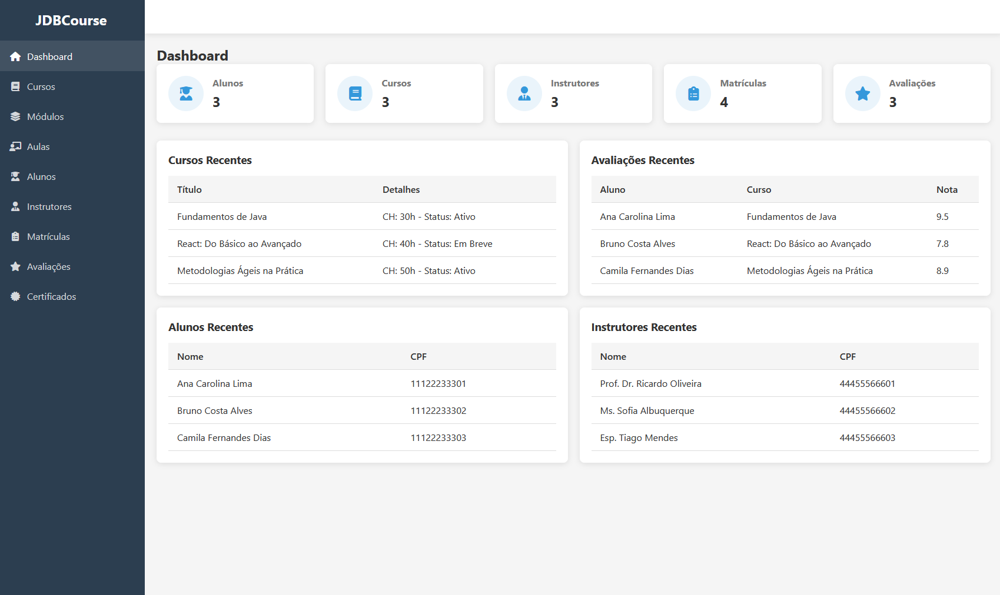
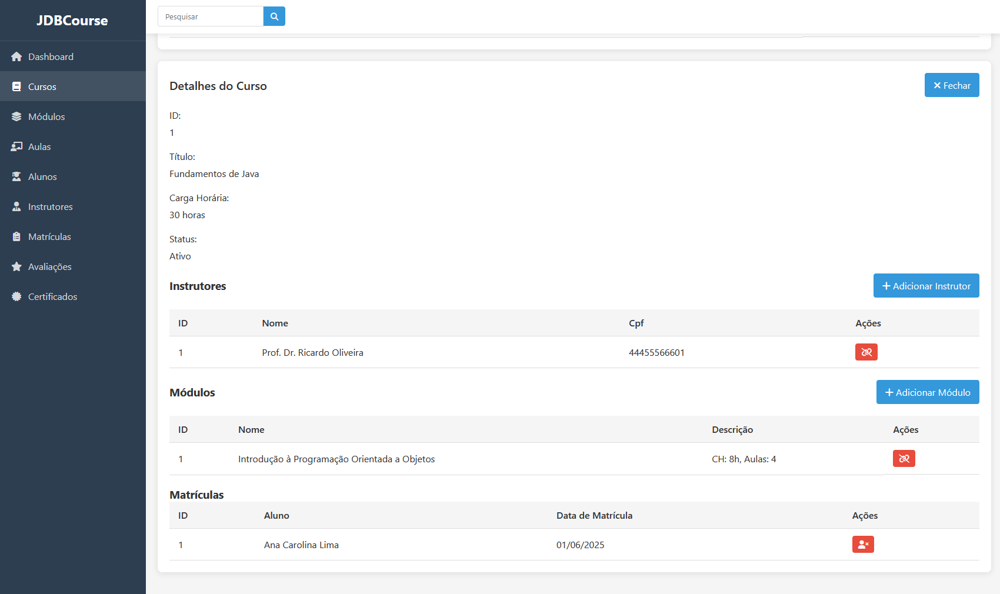
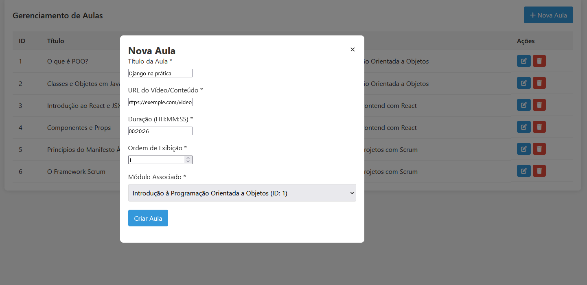

# JDBCourse - Online Course Management System

## English

### 1. Introduction

JDBCourse is a web application designed to manage an online course platform. It allows for the administration of students, instructors, courses, modules, lessons, enrollments, evaluations, and certificates. The backend is built with Java and Spring Boot, utilizing JDBC for database interaction with MySQL. The frontend is developed using plain HTML, CSS, and JavaScript.

This project serves as a practical example of building a full-stack application with a focus on clear backend data access patterns (DAOs with JDBC) and a functional frontend interface.



### 2. Features

* **Dashboard:** Overview statistics (total students, courses, instructors, enrollments, evaluations) and lists of recent items.
* **Student Management:** CRUD operations for students. View student details including their enrollments, evaluations, and certificates.
* **Instructor Management:** CRUD operations for instructors. View courses taught by an instructor.
* **Course Management:** CRUD operations for courses. Manage instructors and modules associated with a course. View enrollments for a course.
* **Module Management:** CRUD operations for modules. Manage lessons within a module. View courses associated with a module.
* **Lesson Management:** CRUD operations for lessons (typically managed within a module context).
* **Enrollment Management:** CRUD operations for student enrollments in courses.
* **Evaluation Management:** Creation and deletion of course evaluations by students.
* **Certificate Management:** Issuance and deletion of course completion certificates.
* **Client-Side Search:** Implemented on list pages for students, courses, modules, lessons, instructors, enrollments, and evaluations.
* **RESTful API:** Backend exposes a RESTful API for all entities.





### 3. Technologies Used

* **Backend:**
    * Java 21 (as per `pom.xml`)
    * Spring Boot 3.x
    * Spring Web (for REST controllers)
    * Spring JDBC (implicitly via custom DAOs)
    * JDBC (for direct database interaction)
    * MySQL Connector/J (JDBC driver)
    * Maven (for project build and dependency management)
* **Frontend:**
    * HTML5
    * CSS3
    * JavaScript (ES6+)
    * Font Awesome (for icons)
* **Database:**
    * MySQL 8.0 (or compatible)
* **Development Environment:**
    * IntelliJ IDEA (recommended)
    * Git (for version control)

#### 4. Frontend

The frontend files (HTML, CSS, JavaScript) are located in `src/main/resources/static/`. They will be served automatically by the embedded Tomcat server when the Spring Boot application runs. No separate build step is required for the frontend in this project.

### 5. Running the Application

#### 5.1. Start the Backend (Spring Boot Application)

1.  In IntelliJ IDEA, locate the `CursosOnlineApplication.java` file (usually in `src/main/java/com/example/cursosonline/`).
2.  Right-click on the file and select "Run 'CursosOnlineApplication.main()'" or click the green play button next to the `main` method.
3.  The Spring Boot application will start. Check the console output for messages indicating that the Tomcat server has started, typically on port `8080`.
    ```
    Tomcat started on port(s): 8080 (http)
    Started CursosOnlineApplication in X.XXX seconds
    ```

#### 5.2. Populate Initial Data (Optional but Recommended)

1.  Once the backend is running (and Hibernate has created/updated the tables due to `ddl-auto=update`), you can run the `DatabaseLoader.java` class (located in `src/main/java/com/example/cursosonline/`) to populate the database with initial sample data.
2.  In IntelliJ IDEA, right-click on `DatabaseLoader.java` and select "Run 'DatabaseLoader.main()'".
3.  Check the console for messages indicating successful data insertion.

#### 5.3. Accessing the Frontend

1.  Open your web browser.
2.  Navigate to: `http://localhost:8080/`
3.  You should see the main dashboard of the JDBCourse application.

### 6. Project Structure Overview

* **`src/main/java/com/example/cursosonline/`**:
    * **`Domain/`**: Contains the Java entity classes (e.g., `Aluno.java`, `Curso.java`).
    * **`DAO/`**: Contains Data Access Object classes for each entity, responsible for JDBC database operations (e.g., `AlunoDAO.java`).
    * **`Controller/`**: Contains Spring MVC REST controllers that expose API endpoints (e.g., `AlunoController.java`).
    * **`Util/`**: Utility classes, like `ConnectionFactory.java`.
    * **`CursosOnlineApplication.java`**: Main Spring Boot application class.
    * **`DatabaseLoader.java`**: Script to populate the database with sample data.
    * **`CrudTest.java`**: Class for testing CRUD operations on DAOs.
* **`src/main/resources/`**:
    * **`application.properties`**: Configuration file for Spring Boot, including database connection details.
    * **`static/`**: Contains all frontend assets:
        * `index.html` (Dashboard homepage)
        * `pages/` (HTML files for each entity management page, e.g., `alunos.html`)
        * `css/styles.css` (Main stylesheet)
        * `js/` (JavaScript files: `api.js`, `utils.js`, and specific logic files like `alunos.js`, `dashboard.js`)
* **`pom.xml`**: Maven project configuration file, listing dependencies and build settings.

### 7. API Endpoints Overview

The backend exposes RESTful API endpoints under the base path `/api`. Key controllers and their base paths include:

* `/api/alunos` - Manages Alunos
* `/api/cursos` - Manages Cursos
* `/api/modulos` - Manages Módulos
* `/api/aulas` - Manages Aulas
* `/api/instrutores` - Manages Instrutores
* `/api/matriculas` - Manages Matrículas
* `/api/avaliacoes` - Manages Avaliações
* `/api/certificados` - Manages Certificados
* `/api/relationships` - Manages relationships between entities (e.g., linking instructors to courses).

Each controller typically supports standard HTTP methods (GET, POST, PUT, DELETE) for CRUD operations. Refer to the specific controller classes for detailed endpoint mappings.

### 8. Database

* **Schema Name:** `cursoonline`
* **Key Entities/Tables:** Aluno, Aula, Avaliacao, Certificado, Curso, Instrutor, Matricula, Modulo.
* **Junction Tables:** `curso_instrutor`, `curso_modulo` for many-to-many relationships.
* **Table Creation:** With `spring.jpa.hibernate.ddl-auto=update` in `application.properties`, Hibernate will attempt to create/update tables based on your Java domain entities annotated with `@Entity` (though the primary data access is via JDBC DAOs in this project, Spring Boot's auto-configuration for JPA might still influence schema management if JPA dependencies are present and entities are scanned). If this setting is not used or set to `none`/`validate`, tables must be created manually.

### 9. Usage / How to Test

* **Frontend Interface:** The primary way to interact with the system is through the web interface starting at `http://localhost:8080/`. Navigate through the sidebar to manage different entities.
* **`DatabaseLoader.java`:** Run this class to populate the database with sample data for testing and demonstration.
* **`CrudTest.java`:** Run this class to perform direct CRUD tests on specific DAOs via their `main` methods.
* **API Testing Tools (Insomnia/Postman):**
    1.  Ensure the backend Spring Boot application is running.
    2.  Use a tool like Insomnia or Postman to send HTTP requests to the API endpoints (e.g., `GET http://localhost:8080/api/alunos` to list all students).
    3.  For `POST` and `PUT` requests, set the `Content-Type` header to `application/json` and provide the appropriate JSON data in the request body.

### 10. Author

* [Gabriel Levi]
* [gablevi@edu.unifor.br]

